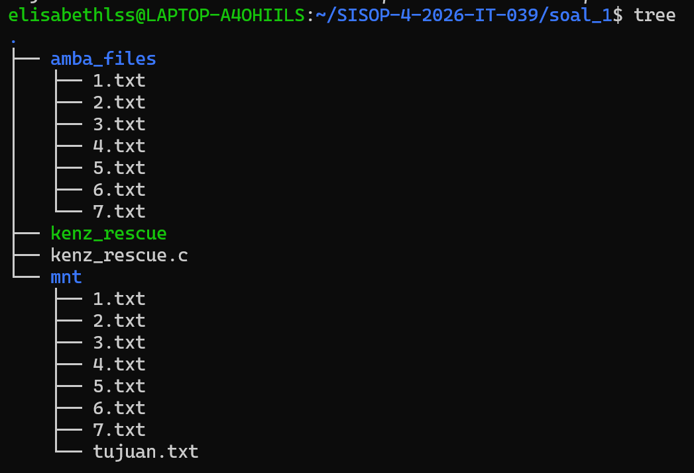
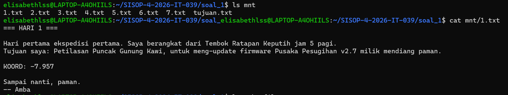
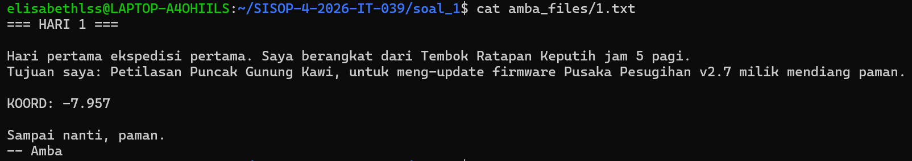
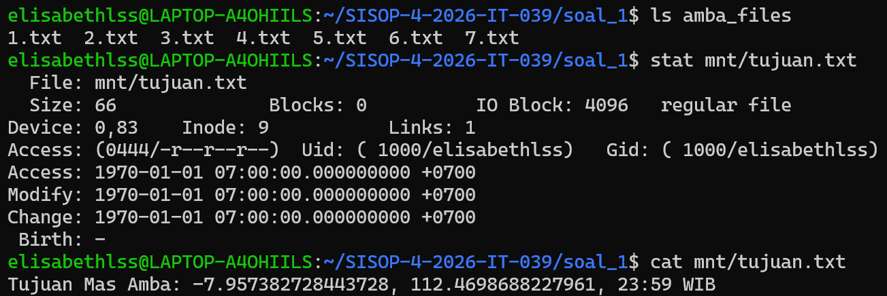

# SISOP-4-2026-IT-039
## Laporan Resmi Modul 4 Sisop oleh Elisabeth L. S. S. | 039
### Soal 1
### Penjelasan

Soal ini meminta kita untuk mengambil arsip `amba_files` lalu menerapkan sistem kerja Linux yaitu **Fuse** untuk mengerjakan beberapa perintah. Hal-hal yang diminta dari soal ini adalah:

a. Mengambil `amba_files` dari *Flashdisk* yang telah diberikan  
b. Membuat program `kenz_rescue.c` yang menerima argumen `<source_directory>` dan `<mount_directory>`  
c. Saat `kenz_rescue.c` di-*mount*, ketujuh file `1.txt` sampai `7.txt` harus muncul mount directory sama persis dengan source  
d. Setelah `./kenz_rescue.c amba_files mnt`, hasil `cat mnt/1.txt` sama dengan `cat amba_files/1.txt`  
e. Membuat file virtual `tujuan.txt`di mount directory. File harus muncul saat `ls mnt/`, ukurannya stabil saat di-*stat*, dan tidak memiliki file fisik di `amba_files`  
f. Saat `cat mnt/tujuan.txt`, menghasilkan output one liner dengan format **"Tujuan Mas Amba: <gabungan_fragmen>"**

#### Instalasi `fuse3`
```
sudo apt install libfuse3-dev fuse3
```
#### Compile & Run file `kenz_rescue.c`
```
gcc kenz_rescue.c `pkg-config fuse3 --cflags --libs` -o kenz_rescue
./kenz_rescue amba_files mnt
```

#### a. Mengambil `amba_files` dari *Flashdisk* yang telah diberikan
Menggunakan `gdown` untuk men-*download* `amba_files` dari link google drive.  
```
gdown "https://drive.google.com/file/d/1nLXFhptDo2mnUlZsw8pTWyAVpV49W20U/view?usp=drive_link"
```
*Unzip* `amba_files.zip`, lalu remove zip nya meninggalkan hanya `amba_files`.
```
unzip amba_files.zip
rm amba_files.zip
```

Buat mount directory sebelum membuat `kenz_rescue.c`.
```
mkdir mnt
```
#### b. Membuat program `kenz_rescue.c` yang menerima argumen `<source_directory>` dan `<mount_directory>`  
```
int main(int argc, char *argv[]) {
    ...

    realpath(argv[1], source_dir);

    char *fuse_argv[2];
    fuse_argv[0] = argv[0]; // ./kenz_rescue
    fuse_argv[1] = argv[2]; // mnt

    return fuse_main(2, fuse_argv, &xmp_oper, NULL);
}
```
: `realpath(argv[1], source_dir);` untuk menangkap argumen pertama dari `amba_files` dan menjadikannya absolute path  
: `char *fuse_argv[2]; ... fuse_argv[1] = argv[2];` untuk menyiapkan argumen fungsi **FUSE**  
: `return fuse_main(2, fuse_argv, &xmp_oper, NULL);` untuk menjalankan **FUSE** di background

##### Membuat Passthrough
```
static int xmp_open(const char *path, struct fuse_file_info *fi) {
    ...

    // part passthrough
    char fpath[4096];
    snprintf(fpath, sizeof(fpath), "%s%s", source_dir, path);

    int res = open(fpath, fi->flags);
    if (res == -1) return -errno;

    close(res);
    return 0;
}
```
: ` int res = open(fpath, fi->flags); ... close(res); return 0;` untuk meng-oper perintah ke linux  

#### c. Saat `kenz_rescue.c` di-*mount*, ketujuh file `1.txt` sampai `7.txt` harus muncul mount directory sama persis dengan source  
##### Fungsi `xmp_readdir`
```
// ...
    DIR *dp = opendir(fpath); // Membuka direktori source (amba_files)
    if (dp == NULL) return -errno;

    struct dirent *de;
    while ((de = readdir(dp)) != NULL) {
        struct stat st;
        memset(&st, 0, sizeof(st));
        st.st_ino = de->d_ino;
        st.st_mode = de->d_type << 12;
        
        if (filler(buf, de->d_name, &st, 0, 0)) break;
    }
    closedir(dp);
```
: ` while ((de = readdir(dp)) != NULL) {...st.st_mode = de->d_type << 12;` untuk membaca isi direktori source dari `1.txt` sampai `7.txt`  
**Output**  


#### d. Setelah `./kenz_rescue.c amba_files mnt`, hasil `cat mnt/1.txt` sama dengan `cat amba_files/1.txt` 
##### Fungsi `generate_tujuan_content` (`cat` atau `stat`)
```
// ... 
    char fpath[4096];
    snprintf(fpath, sizeof(fpath), "%s%s", source_dir, path);
    
    int fd = open(fpath, O_RDONLY); // Membuka file fisik
    if (fd == -1) return -errno;

    int res = pread(fd, buf, size, offset);
    if (res == -1) res = -errno;

    close(fd);
    return res;
```
: `snprintf(fpath, sizeof(fpath), "%s%s", source_dir, path);` sebagai jalur ke `1.txt` asli  di `amba_files`   
: ` int res = pread(fd, buf, size, offset);...return res;` untuk membaca isi file asli dan membuatnya di `buf` untuk ditampilkan  
**Output**  
  


#### e. Membuat file virtual `tujuan.txt`di mount directory. File harus muncul saat `ls mnt/`, ukurannya stabil saat di-*stat*, dan tidak memiliki file fisik di `amba_files`  
##### Fungsi `xmp_readdir`
```
    if (strcmp(path, "/") == 0) {
        filler(buf, "tujuan.txt", NULL, 0, 0);
    }
```
: untuk injeksi `ls`, memaksa file `tujuan.txt` ada di terminal saat di root folder  
##### Fungsi `xmp_getattr`
```
    if (strcmp(path, "/tujuan.txt") == 0) {
        stbuf->st_mode = S_IFREG | 0444; 
        stbuf->st_nlink = 1;

        char content[4096];
        generate_tujuan_content(content, sizeof(content)); 

        stbuf->st_size = strlen(content); 

        stbuf->st_uid = getuid();
        stbuf->st_gid = getgid();
        return 0;
    }
```
: `char content[4096]; generate_tujuan_content(content, ... ; stbuf->st_size = strlen(content);` untuk membuat isi konten `stat` dan menghitung ukurannya  
**Output**  




#### f. Saat `cat mnt/tujuan.txt`, menghasilkan output one liner dengan format "Tujuan Mas Amba: <gabungan_fragmen>"
##### Fungsi `generate_tujuan_content`
```
void generate_tujuan_content(char *output_buffer, size_t buf_size) {
    char fragment[1024] = "";
    char line[256];

    for (int i = 1; i <= 7; i++) {
            while (fgets(line, sizeof(line), f)) {
                if (strncmp(line, "KOORD: ", 7) == 0) {
                    line[strcspn(line, "\r\n")] = 0; 
                    strncat(fragment, line + 7, sizeof(fragment) - strlen(fragment) - 1);
                    break; 
                }
            }
    }
    snprintf(output_buffer, buf_size, "Tujuan Mas Amba: %s\n", fragment);
}
```
: `while (fgets(line, sizeof(line), f)) {... break; }` untuk membuka file `1.txt` sampai `7.txt`, mencari fragmen **"KOORD: "**, menghapus enter, dan menggabungkan teksnya  
: `snprintf(output_buffer, buf_size, "Tujuan Mas Amba: %s\n", fragment);` untuk menyatukan fragmen dengan format yang ada

**Output**  


